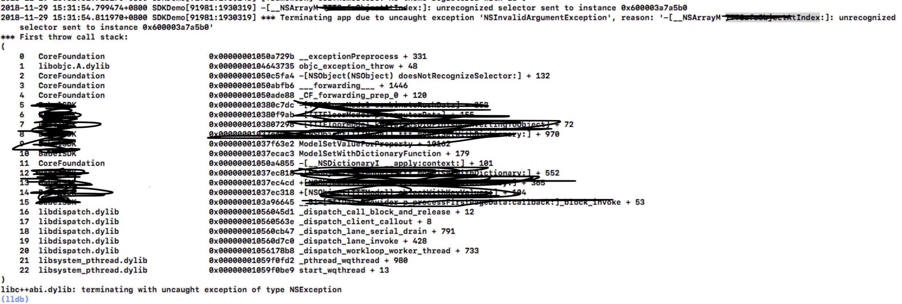
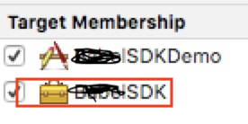
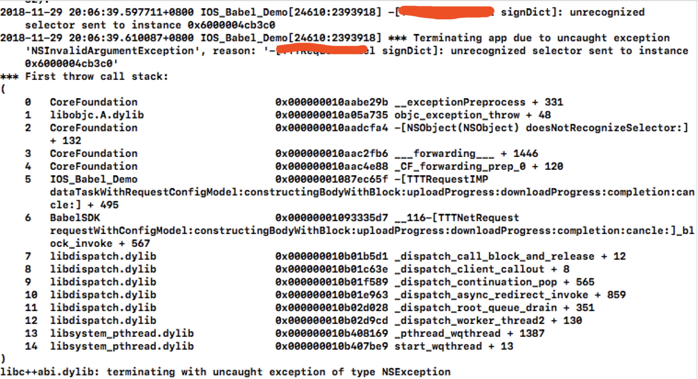

####iOS 制作动态framework 及 嵌套私有静态framework

#### 1、制作步骤

1. 创建Cocoa Touch Framework工程；
2. 添加各种文件；
3. 选中SDK target，在build phases的Headers一栏中将需要公开的头文件移入Public中，并在SDK.h文件中添加相应的引用，如`#import <YXLSDK/PublicHeader.h>`；
4. 设置： 
   * Build Settings中，查看Architectures和Valid Architectures两栏，一般设置为armv7 arm64 armv7s；
   * Build Settings中，Mach-O Type设置为Dynamic Library；
5. 选择模拟器，编译生成framework；选择真机，编译生成framework；

> 通过`lipo -info YXLSDK.framework/YXLSDK` 可以查看framework支持哪几个指令集，模拟器的指令集包括：i386和x86_64，真机的指令集包括armv7、armv7s和arm64。

> > arm64：iPhone6s | iphone6s plus｜iPhone6｜ iPhone6 plus｜iPhone5S | iPad Air｜ iPad mini2（iPad mini with Retina Display）

> > armv7s：iPhone5｜iPhone5C｜iPad4（iPad with Retina Display）

> > armv7：iPhone4｜iPhone4S｜iPad｜iPad2｜iPad3（The New iPad）｜iPad mini｜iPod Touch 3G｜iPod Touch4 

> > i386: iPhone5 | iPhone 4s | iPhone 4及前代产品的模拟器 

> > x86_64: iPhone5s | iPhone 6 | ... | iPhone8的模拟器 

6. 合并两个framework，使其支持所有指令集

> 使用命令 `lipo -create Debug-iphonesimulator/YXLDemo.framework/YXLDemo Debug-iphoneos/YXLDemo.framework/YXLDemo --output YXLDemo`生成一个名为 YXLDemo 的可执行文件，将它替换Debug-iphoneos/YXLDemo.framework/YXLDemo，则Debug-iphoneos/YXLDemo.framework这个framework就支持了多种指令集，可用lipo -info命令验证。

#### 2、嵌套私有静态framework

需求：动态framework中使用了一个内部的静态framework，需要将静态framework嵌套在动态framework中去，不能让第三方获取到内部的静态framework。

步骤：

1. 选中PrivateStatic.framework，勾选Target Membership中的两项（确保SDK target被选中）；
2. 选中SDK target，在General的Linked Frameworks and Librarie中添加PrivateStatic.framework；
3. 同上1的制作步骤制作动态framework。

#### 3、遇到的问题及解决方法

1. 正确引用生成的framework后，运行报错如下：

问题原因：实现该方法的.m文件未包含在SDK target中；

解决方法：选中该.m文件，检查Target Membership中是否勾选了SDK target。

2. 报错类型同1，都是找不到方法，报错如下：

问题原因：缺少库引用，需要引用libc++.tbd库；

解决方法：在Target->SDK，General中的Linked Frameworks and Libraries中引用libc++.tbd库。

3. 报错：Undefined symbols for architecture armv7s

在制作动态库时，报Undefined symbols for architecture armv7s，检查后，原因是嵌套的私有静态库不支持armv7s指令集（可通过`lipo -info`查看），解决方法：如上制作步骤4中，临时将Architectures和Valid Architectures中的armv7s删除，在获取完整的私有静态库后重新制作。

#### 4、相关知识点

1. 指令集（CPU与硬件相配合的指令集）

* 苹果处理器支持两个不同的指令集：32位ARM指令集（armv6、armv7、armv7s）和64位ARM指令集（arm64）;

* Mac处理器的指令集：i386和x86_64

* XCode中设置指令集：

  1）Architectures：指定工程将被编译成支持哪些指令集，支持的指令集是通过编译生成对应的二进制数据包实现的，所以支持的指令集越多，生成的数据包越多，最后的包也越大；

  2）Valid Architectures：指定可能支持的指令集，这个选项和Architectures的选项的交集是最终包所支持的指令集。

  3）Build Active Architecture Only：设置是否使用当前设备对应的ARM指令集，若为YES，则无论Architectures和Valid Architectures的设置是什么，都置生成当前设备支持的指令集的二进制包。

2. 动态库 vs. 静态库

* 静态库：静态链接库，在编译时会被直接拷贝一份，复制到目标程序中，这段代码在目标程序里就不会再改变了。好处：编译完成后，库文件时机上没有作用了，目标程序没有外部依赖，可以直接运行；缺点：目标程序的体积增大。
* 动态库（共享库）：动态链接库，动态库在编译时不会被拷贝到目标程序中，目标程序中只会存储指向动态库的引用。等程序运行时，才会被加载进目标程序。优点：不需要拷贝到目标程序，也不影响目标程序的体积，而且同一份库可以被多个程序使用，并且可以动态载入或替换，不需要重新编译代码；缺点：性能损失，且依赖于外部环境。

https://www.jianshu.com/p/d0c7254319b6
