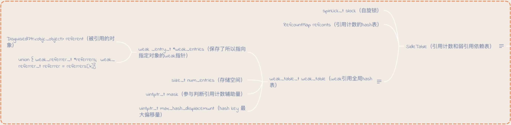

# weak的实现原理总结记录

根据代码：

```objective-c
NSObject *obj = [[NSObject alloc] init];
__weak NSObject *weakObj = obj;
```

来分析weak的实现过程。


1. objc_initWeak

运行后，首先会调用`objc_initWeak`，上述代码会变成`objc_initWeak(&weakObj, obj)`。`obj_initWeak`方法的具体实现如下：

```c++
id
objc_initWeak(id *location, id newObj)
{
    if (!newObj) {
        *location = nil;
        return nil;
    }

    return storeWeak<DontHaveOld, DoHaveNew, DoCrashIfDeallocating>
        (location, (objc_object*)newObj);
}
```

1、进行判空，若被引用对象为空，则不执行；

2、调用`storeWeak`方法，上述代码应为`storeWeak(&weakObj, obj)`


2. storeWeak

`storeWeak`方法的具体实现如下：

```c++
template <HaveOld haveOld, HaveNew haveNew,
          CrashIfDeallocating crashIfDeallocating>
static id 
storeWeak(id *location, objc_object *newObj)
{
    assert(haveOld  ||  haveNew);
    if (!haveNew) assert(newObj == nil);

    Class previouslyInitializedClass = nil;
    id oldObj;
    SideTable *oldTable;
    SideTable *newTable;

    // Acquire locks for old and new values.
    // Order by lock address to prevent lock ordering problems. 
    // Retry if the old value changes underneath us.
 retry:
    if (haveOld) {
        oldObj = *location;
        oldTable = &SideTables()[oldObj];
    } else {
        oldTable = nil;
    }
    if (haveNew) {
        newTable = &SideTables()[newObj];
    } else {
        newTable = nil;
    }

    SideTable::lockTwo<haveOld, haveNew>(oldTable, newTable);

    if (haveOld  &&  *location != oldObj) {
        SideTable::unlockTwo<haveOld, haveNew>(oldTable, newTable);
        goto retry;
    }

    // Prevent a deadlock between the weak reference machinery
    // and the +initialize machinery by ensuring that no 
    // weakly-referenced object has an un-+initialized isa.
    if (haveNew  &&  newObj) {
        Class cls = newObj->getIsa();
        if (cls != previouslyInitializedClass  &&  
            !((objc_class *)cls)->isInitialized()) 
        {
            SideTable::unlockTwo<haveOld, haveNew>(oldTable, newTable);
            _class_initialize(_class_getNonMetaClass(cls, (id)newObj));

            // If this class is finished with +initialize then we're good.
            // If this class is still running +initialize on this thread 
            // (i.e. +initialize called storeWeak on an instance of itself)
            // then we may proceed but it will appear initializing and 
            // not yet initialized to the check above.
            // Instead set previouslyInitializedClass to recognize it on retry.
            previouslyInitializedClass = cls;

            goto retry;
        }
    }

    // Clean up old value, if any.
    if (haveOld) {
        weak_unregister_no_lock(&oldTable->weak_table, oldObj, location);
    }

    // Assign new value, if any.
    if (haveNew) {
        newObj = (objc_object *)
            weak_register_no_lock(&newTable->weak_table, (id)newObj, location,
                                  crashIfDeallocating);
        // weak_register_no_lock returns nil if weak store should be rejected

        // Set is-weakly-referenced bit in refcount table.
        if (newObj  &&  !newObj->isTaggedPointer()) {
            newObj->setWeaklyReferenced_nolock();
        }

        // Do not set *location anywhere else. That would introduce a race.
        *location = (id)newObj;
    }
    else {
        // No new value. The storage is not changed.
    }
    
    SideTable::unlockTwo<haveOld, haveNew>(oldTable, newTable);

    return (id)newObj;
}
```

这里涉及到C++的模板概念，由于对模板不太了解，所以就仅看精简后的haveNew为TRUE的分支，精简后的主要代码及注释如下：

```c++
static id 
storeWeak(id *location, objc_object *newObj)
{
    Class previouslyInitializedClass = nil;
    id oldObj;
    SideTable *oldTable;
    SideTable *newTable;

 retry:
    if (haveOld) {
        oldObj = *location;
        oldTable = &SideTables()[oldObj];
    } else {
        oldTable = nil;//没有旧的table
    }
    if (haveNew) {
        newTable = &SideTables()[newObj];//获取obj对应的SideTable实例
    } else {
        newTable = nil;
    }

    if (haveNew) {
        newObj = (objc_object *)
            weak_register_no_lock(&newTable->weak_table, (id)newObj, location,
                                  crashIfDeallocating);//注册并存储弱引用对象

        //设置是否包含弱引用的标识位
        if (newObj  &&  !newObj->isTaggedPointer()) {
            newObj->setWeaklyReferenced_nolock();
        }

        //设置地址指向
        *location = (id)newObj;
    }
    else {
        // No new value. The storage is not changed.
    }

    return (id)newObj;
}
```

其中的`weak_register_no_lock`方法实现了弱引用对象的注册和存储。


3. `weak_register_no_lock`方法的具体实现如下：

```c++
id 
weak_register_no_lock(weak_table_t *weak_table, id referent_id, 
                      id *referrer_id, bool crashIfDeallocating)
{
    objc_object *referent = (objc_object *)referent_id;//obj
    objc_object **referrer = (objc_object **)referrer_id;//&weakObj

    if (!referent  ||  referent->isTaggedPointer()) return referent_id;

    // ensure that the referenced object is viable
    bool deallocating;
    if (!referent->ISA()->hasCustomRR()) {
        deallocating = referent->rootIsDeallocating();
    }
    else {
        BOOL (*allowsWeakReference)(objc_object *, SEL) = 
            (BOOL(*)(objc_object *, SEL))
            object_getMethodImplementation((id)referent, 
                                           SEL_allowsWeakReference);
        if ((IMP)allowsWeakReference == _objc_msgForward) {
            return nil;
        }
        deallocating =
            ! (*allowsWeakReference)(referent, SEL_allowsWeakReference);
    }

    if (deallocating) {
        if (crashIfDeallocating) {
            _objc_fatal("Cannot form weak reference to instance (%p) of "
                        "class %s. It is possible that this object was "
                        "over-released, or is in the process of deallocation.",
                        (void*)referent, object_getClassName((id)referent));
        } else {
            return nil;
        }
    }

    // now remember it and where it is being stored
    weak_entry_t *entry;//弱引用数组
    if ((entry = weak_entry_for_referent(weak_table, referent))) {
        append_referrer(entry, referrer);
    } 
    else {
        weak_entry_t new_entry(referent, referrer);
        weak_grow_maybe(weak_table);
        weak_entry_insert(weak_table, &new_entry);
    }

    // Do not set *referrer. objc_storeWeak() requires that the 
    // value not change.

    return referent_id;
}
```

同样取精简代码进行分析，精简后的代码和注释如下：

```c++
id 
weak_register_no_lock(weak_table_t *weak_table, id referent_id, 
                      id *referrer_id, bool crashIfDeallocating)
{
    objc_object *referent = (objc_object *)referent_id;//这里指的是obj
    objc_object **referrer = (objc_object **)referrer_id;//这里指的是weakObj的指针

    weak_entry_t *entry;
    //获取obj对应的弱引用表，若能获得，则把weakObj添加进弱引用表中；否则新建一个弱引用表
    if ((entry = weak_entry_for_referent(weak_table, referent))) {
        append_referrer(entry, referrer);//具体代码不贴了，主要逻辑就是在获得的弱引用表的最后加入weakObj，并把count加一
    } 
    else {
        weak_entry_t new_entry(referent, referrer);
        weak_grow_maybe(weak_table);
        weak_entry_insert(weak_table, &new_entry);
    }

    return referent_id;
}
```

`weak_entry_for_referent`方法实现了弱引用表的hash查找，具体实现如下：

```c++
static weak_entry_t *
weak_entry_for_referent(weak_table_t *weak_table, objc_object *referent)
{
    weak_entry_t *weak_entries = weak_table->weak_entries;//获得全局的弱引用表

    if (!weak_entries) return nil;

    size_t begin = hash_pointer(referent) & weak_table->mask;//hash算法获得索引
    size_t index = begin;
    size_t hash_displacement = 0;
    //hash碰撞处理，逐步获得正确的索引
    while (weak_table->weak_entries[index].referent != referent) {
        index = (index+1) & weak_table->mask;
        if (index == begin) bad_weak_table(weak_table->weak_entries);
        hash_displacement++;
        if (hash_displacement > weak_table->max_hash_displacement) {
            return nil;
        }
    }
    
    //通过索引返回Obj对应的弱引用表
    return &weak_table->weak_entries[index];
}
```


4. 释放过程

方法调用过程是：

`clearDeallocating`  -> `weak_clear_no_lock`

`weak_clear_no_lock`方法的具体实现：

```c++
void 
weak_clear_no_lock(weak_table_t *weak_table, id referent_id) 
{
    objc_object *referent = (objc_object *)referent_id;

    weak_entry_t *entry = weak_entry_for_referent(weak_table, referent);
    if (entry == nil) {
        /// XXX shouldn't happen, but does with mismatched CF/objc
        //printf("XXX no entry for clear deallocating %p\n", referent);
        return;
    }

    // zero out references
    weak_referrer_t *referrers;
    size_t count;
    
    if (entry->out_of_line()) {
        referrers = entry->referrers;
        count = TABLE_SIZE(entry);
    } 
    else {
        referrers = entry->inline_referrers;
        count = WEAK_INLINE_COUNT;
    }
    
    for (size_t i = 0; i < count; ++i) {
        objc_object **referrer = referrers[i];
        if (referrer) {
            if (*referrer == referent) {
                *referrer = nil;
            }
            else if (*referrer) {
                _objc_inform("__weak variable at %p holds %p instead of %p. "
                             "This is probably incorrect use of "
                             "objc_storeWeak() and objc_loadWeak(). "
                             "Break on objc_weak_error to debug.\n", 
                             referrer, (void*)*referrer, (void*)referent);
                objc_weak_error();
            }
        }
    }
    
    weak_entry_remove(weak_table, entry);
}
```

主要流程就是遍历弱引用数组，把每个弱引用对象置为nil，然后把当前的弱引用表从全局表中删除。


5. 涉及的各种结构体以及相互关系

上述代码中涉及的结构体及相互关系可见下图：



其中需要说明的点是：

（1）`SideTable`是引用计数和弱引用依赖表，runtime用一个静态数组作为Buffer保存了所有的SideTable实例，通过提供的工厂方法，可以根据对象获得对应的SideTable实例；

（2）每一个`SideTable`所持有的weak_table都是全局的弱引用表，根据对象地址，通过hash算法，可以获得一个包含原对象（obj）和其对应的弱引用对象或者弱引用对象数组，就是一个weak_entry_t。


6. 总结

概括上述内容，weak的实现原理是：

简单来说，是由runtime维护了一个弱引用表，通过hash算法，可以获得相应对象的弱引用数组，并将新的弱引用对象指针添加到弱引用数组中。


7. 参考资料

http://yulingtianxia.com/blog/2015/12/06/The-Principle-of-Refenrence-Counting/

https://www.jianshu.com/p/13c4fb1cedea

http://solacode.github.io/2015/10/21/Runtime%E5%A6%82%E4%BD%95%E5%AE%9E%E7%8E%B0weak%E5%B1%9E%E6%80%A7%EF%BC%9F/

http://www.cocoachina.com/ios/20170328/18962.html