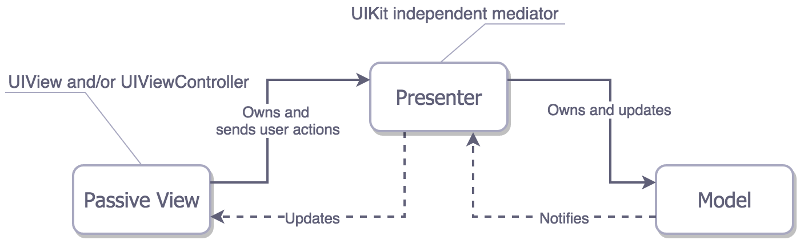

1. Q：`[self class]` vs. `[super class]`

A：self 和 super区别：self是隐藏参数，指向调用方法的类；super为编译器指示符，会生成`objc_super`，包含指向self的id类型的receiver和指向实际用于查找方法的类对象（即父类）。

`[self class]` => `objc_msgSend(self, @selector(class))`， 在self的类对象中查找方法；

`[super class]` => `objc_msgSendSuper(self, @selector(class))` => `objc_msgSend(objc_super->receiver, @selector(class))`，在objc_super->Class（父类的类对象）中查找方法。

而class是元类NSObject的class，所以返回值一样。

2. Q：消息处理过程

A：[object method] => msgSend(object, @selector(methods))

**第一步：消息发送。**

a) 判断selector是否需要被忽略，如release、retain等；

b) 判断target是否为nil，若是，则忽略<u>*（向nil发送消息不会crash的原因）*</u>

c) 在target的类对象的方法cache中查找selector，若找到了，则直接调用方法；

d) 在类对象的方法列表中查找selector，找不到则在父类的方法列表中查找，直至NSObject类，若都未找到，则进行动态方法解析。

**第二步：动态解析。**（开始消息转发）

重写 resolveInstanceMethod 或者 resolveClassMehod 方法，在方法中添加selector的对应实现，并return YES。若不添加则返回NO，进入消息转发。

**第三步：消息转发。（可用于实现多继承）**

a) 重定向。

转发消息之前可以替换消息接收者，通过`-(id)forwardingTargetForSelector:(SEL)aSelector`方法，返回一个替换接收者。若返回nil或者self，则进入下一步转发；否则向替代者重新发送消息。

b) 消息转发。

runtime向对象发送`methodSignatureForSelector:`消息，获得一个方法签名生成NSInvocation对象，所以，需要重写`methodSignatureForSelector:`方法，否则会报异常。

重写 `-(void)forwardInvocation:(NSInvocation *)anInvocation`方法（该方法默认只调用doesNotRecognizeSelector），可以在该方法中对不能处理的消息进行处理（如统一上报、避免crash处理），也可以把消息转发给其他对象处理，从而不抛异常。

`forwardInvocation`是一个无法识别消息的分发中心，可以进行统一处理，避免crash。

参考：https://www.jianshu.com/p/82860fd8222c

3. MVC、MVP、MVVM——只关注Apple的结构（因为版本太多啦）

（1）MVC

Apple期望的MVC结构如图：

 Apple实际实现的MVC结构如图：

（2）MVP

带监控的MVP

（3）MVVM

ViewModel是什么？

ViewModel是独立于UIKit的View的状态，可以通过调用Model来改变数据，也可以通过数据变更来更新自己。

参考：https://www.jianshu.com/p/b849c6972216

4. 简单工厂模式 vs. 工厂模式 vs. 抽象工厂模式

（1）简单工厂模式——选择实现

简单工厂就是根据传入的参数选择生成哪种类型的对象而已，具体实现不管。

使用场景：想完全封装隔离具体实现；想把创建对象的职责集中管理起来。

违反了依赖导致原则（要依赖抽象，不要依赖具体）

（2）工厂模式（强调一类）

工厂模式就是抽象一个父类对象，创建多个工厂，由相应的工厂创建自己的子类对象。即把对象的创建延迟到子类执行。

使用场景：一个类不想知道他所需要创建的对象所属的类；一个类希望由它的子类来指定它所创建的对象。

（例如，UITableViewCell的用法）

（3）抽象工厂模式（强调遵循抽象接口的一系列）

抽象工厂模式是通过定义一系列相关或者相互依赖的接口来标志一类对象（id<Protocol>的方式），而不是通过继承父类。

使用场景：客户端只希望知道抽象接口，而不关心具体实现时；一个系统需要有多个产品系列中的一个来配置时；需要强调一系列产品的接口有关联时。

5. load方法 vs. initialize方法

load方法是在一个类被初始装载时调用，子类、父类以及分类中的load方法会被区别对待，即分类中的load方法实现不会影响主类；

initialize方法是在应用第一次调用该类的类方法或实例方法前调用的，若一直没有被调用方法，则不会执行，是懒加载的方式。

6. weak实现原理

id __weak obj1 = obj;        =>    id obj1;      objc_initWeak(&obj1, obj);

经过编译，会经过调用，在weak_register_no_lock函数中进行弱引用变量的添加，添加的位置是由哈希算法获得，若能获得相应变量的弱引用数组，则在弱引用数组中插入当前弱引用对象的指针；没有的话，就创建一个新的弱引用数组，并把当前弱引用对象指针当做数组的第一个元素，后面都置为nil。

